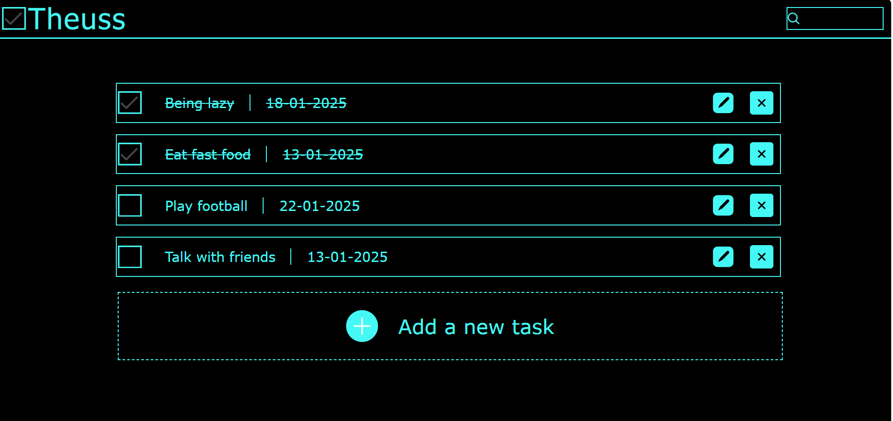

# Theuss - Minimalist To-Do List App 📝

**Theuss** is a minimalist to-do list application designed to help you stay in control and keep your tasks centralized. Inspired by the Greek word "Theo," which signifies control and power, Theuss embodies the idea of keeping everything under your command in a simple and organized way. 

## Screenshots 📸

Below are some screenshots of the **Theuss** app in action:




## Features ✨

- **Theuss check** ✅: Theuss can be checked to show the done tasks, letting you free to see just the things you have to achieve, or everything.
- **Super Minimalist Design**: Theuss follows a clean and simple design philosophy, with an emphasis on ease of use and focus. It helps you concentrate on what matters most: your tasks.
- **Task Management**: Easily add, edit, or remove tasks, and stay on top of your daily to-dos.
- **Customizable Colors 🎨**: In line with its minimalist approach, Theuss allows you to personalize the primary and secondary colors of the interface. Choose your favorite color scheme, but only two colors to maintain the app's simplicity.
- **No Clutter 🚫**: No distractions, no unnecessary features. Theuss sticks to the essentials for a smooth and enjoyable experience.

## Design Philosophy 💡

Theuss embraces a minimalist design, which means fewer options but better focus on your tasks. It eliminates the distractions of complex features and gives you just the tools you need to organize your life. The two color customization options (primary and secondary) are designed to give you control over the aesthetics without overwhelming you with choices. No footer inteded.

## How to Use 📋

1. **Add Tasks ➕**: Simply click on the input field to add a new task to your list.
2. **Edit Tasks ✏️**: Click on a task to edit it and make necessary changes.
3. **Delete Tasks 🗑️**: Tasks can be removed with a single click, keeping your to-do list clean and up to date.
4. **Color Customization 🎨**: Personalize the app by changing the primary and secondary colors to your preference. Go to settings and choose your colors.

## Installation ⚙️

To run Theuss locally, follow these steps:

1. Clone the repository:
   ```bash
   git clone https://github.com/yourusername/theuss.git
   ```
2. Navigate to the project directory:
  ```bash
  cd theuss
  ```
3. Install dependencies:
  ```bash
  npm install
  ```
4. Run the app:
  ```bash
  npm start
  ```
5. Now you can use Theuss locally in your browser at http://localhost:3000 !

## Contributing 🤝
If you would like to contribute to Theuss, feel free to fork the repository, create a new branch, and submit a pull request. All contributions are welcome!

## License 📜
This project is licensed under the MIT License - see the LICENSE file for details.

## Next Steps 🚀

Here are some planned features to improve **Theuss**:

1. **Assigning Color for the Checkmark**: Add a customization option to change the color of the task completion checkmark.
2. **Recursive Color Selection**: Implement a feature that allows for recursive color customization, giving users more control over color elements throughout the app.
3. **Storage with localStorage**: Add functionality to store the to-do list and color preferences in the browser's localStorage, allowing users to retain their data between sessions.
4.  **Arrow button input**: Add functionality to go down wherever the add new input is and up to go to the first task.
---

Stay in control, stay minimal with **Theuss**. ⚡
